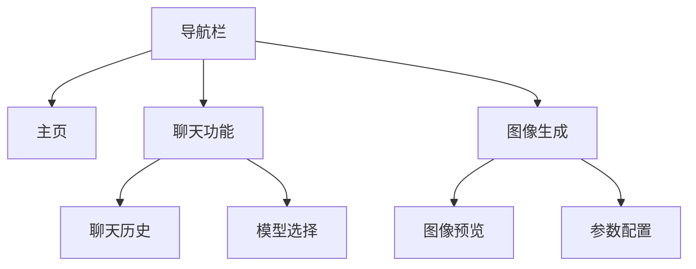

# 前端技术文档

## 前端架构



## 页面结构

### 1. 主页 (index.html)
```html
<!DOCTYPE html>
<html lang="zh">
<head>
    <!-- 头部信息 -->
</head>
<body>
    <header>
        <div class="logo">AI</div>
        <nav>
            <ul>
                <li><a href="index.html">主页</a></li>
                <li><a href="chat.html">聊天功能</a></li>
                <li><a href="generate.html">图像生成</a></li>
            </ul>
        </nav>
    </header>
    <div class="main-content">
        <!-- 主页内容 -->
    </div>
</body>
</html>
```

### 2. 聊天功能 (chat.html)
- 聊天消息区域显示用户和AI的对话
- 支持Markdown渲染
- 代码高亮显示
- 历史对话记录保存
- 模型选择功能

### 3. 图像生成 (generate.html)
- 提示词输入
- 模型选择
  - FLUX.1-schnell (免费)
  - FLUX.1-dev (收费，质量更好)
  - Stable Diffusion 3.5 Large
  - Stable Diffusion 3.5 Large Turbo
  - Janus-Pro-7B (理解与生成)
- 分辨率选择: 512×512, 768×768, 1024×1024
- 图像数量设置
- 生成图像展示和下载

## 前端技术实现

### 核心技术
- 原生HTML5 + CSS3 + JavaScript ES6
- 无框架依赖，轻量级设计
- 外部库:
  - HighlightJS: 代码高亮
  - Marked: Markdown解析
  - Font Awesome: 图标

### 样式结构
```
frontend/
├── assets/
│   ├── style.css     # 全局样式
│   ├── chat.css      # 聊天页面样式
│   └── prism-dark.css # 代码高亮样式
```

### 关键功能实现

#### 1. 聊天功能实现
```javascript
// 发送聊天消息
async function sendMessage() {
    const messageInput = document.getElementById('message-input');
    const message = messageInput.value.trim();
    
    if (!message) return;
    
    // 添加用户消息到聊天区域
    appendMessage('user', message);
    messageInput.value = '';
    
    // 构建请求数据
    const data = {
        model: document.getElementById('model-select').value,
        messages: chatHistory,
        temperature: parseFloat(document.getElementById('temperature').value),
        max_tokens: parseInt(document.getElementById('max-tokens').value)
    };
    
    // 发送请求到后端
    try {
        const response = await fetch('/api/chat', {
            method: 'POST',
            headers: { 'Content-Type': 'application/json' },
            body: JSON.stringify(data)
        });
        
        // 处理流式响应
        const reader = response.body.getReader();
        processStreamResponse(reader);
    } catch (error) {
        console.error('Error:', error);
        showError('发送消息失败，请稍后重试');
    }
}
```

#### 2. 图像生成功能实现
```javascript
// 图像生成
async function generateImage() {
    const prompt = document.getElementById('prompt').value.trim();
    if (!prompt) {
        showError('请输入图片描述');
        return;
    }
    
    const model = document.getElementById('model').value;
    const width = document.getElementById('width').value;
    const height = document.getElementById('height').value;
    const batchSize = parseInt(document.getElementById('numImages').value);
    
    showLoading('正在生成图像，请稍候...');
    
    try {
        const response = await fetch('/api/generate', {
            method: 'POST',
            headers: { 'Content-Type': 'application/json' },
            body: JSON.stringify({
                prompt,
                model,
                width,
                height,
                batch_size: batchSize
            })
        });
        
        const result = await response.json();
        displayGeneratedImages(result.images);
    } catch (error) {
        console.error('Error:', error);
        showError('图像生成失败，请稍后重试');
    } finally {
        hideLoading();
    }
}
```

## Docker开发环境

前端服务使用独立的Docker容器进行开发:

```dockerfile
# Dockerfile.dev
FROM nginx:alpine
WORKDIR /app
COPY . /app
COPY nginx.conf /etc/nginx/conf.d/default.conf
EXPOSE 3000
```

开发环境配置:
```yaml
# docker-compose.dev.yml (前端部分)
frontend:
  build: 
    context: ./frontend
    dockerfile: Dockerfile.dev
  ports:
    - "3000:3000"
  volumes:
    - type: bind
      source: ./frontend
      target: /app
  environment:
    - NODE_ENV=development
  restart: unless-stopped
  depends_on:
    - backend
```

## 最佳实践与优化

### 1. 性能优化
- 资源预加载
- 延迟加载非关键资源
- 图片压缩和优化

### 2. 安全实践
- 输入验证
- CSP (Content Security Policy)
- 避免使用eval()和inline事件处理

### 3. 开发流程
- 使用dev.sh辅助脚本启动开发环境
- 前端代码更改自动同步到容器
- 浏览器访问http://localhost:3000进行测试 