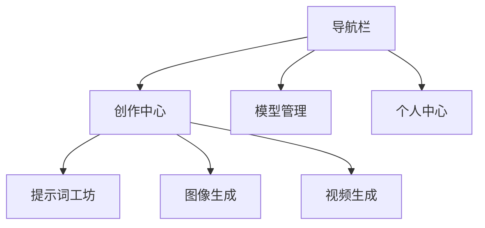

# 前端技术文档

## 界面架构



## 核心页面设计

### 1. 创作中心
```mermaid
graph LR
    A[提示词输入区] --> B[参数面板]
    B --> C[实时预览]
    C --> D[生成控制]
    D --> E[历史记录]
    
    功能模块:
    - 多模态输入支持文本/图片
    - 参数预设模板
    - 实时生成进度展示
    - 版本对比功能
```

### 2. 模型管理
```mermaid
graph TB
    A[模型列表] --> B[云端模型]
    A --> C[本地模型]
    B --> D[加载/卸载]
    C --> E[文件上传]
    D --> F[资源监控]
    
    功能要点:
    - 模型兼容性检测
    - 显存占用可视化
    - 推理速度测试
```

## 技术实现

| 模块         | 技术方案               | 版本   |
|--------------|-----------------------|-------|
| 核心         | 原生HTML5 + ES6 + CSS3 | -     |
| 样式库       | Bootstrap 5           | 5.3.0 |
| 交互         | jQuery                | 3.7.0 |
| UI组件库     | Bootstrap组件         | 5.3.0 |
| 可视化       | Chart.js              | 4.0.0 |

## 代码示例

### 核心交互逻辑

```javascript
// frontend/app.js 核心交互逻辑
$(document).ready(function() {
    // 初始化工具提示
    $('[data-bs-toggle="tooltip"]').tooltip()
    
    // 生成按钮点击事件
    $('#generate-btn').click(async () => {
        const params = {
            prompt: $('#prompt-input').val(),
            width: $('#width-select').val()
        }
        
        try {
            const res = await fetch('/api/generate', {
                method: 'POST',
                headers: {'Content-Type': 'application/json'},
                body: JSON.stringify(params)
            })
            updateResult(await res.json())
        } catch (err) {
            showError(err.message)
        }
    })
})
```

### 前端组件结构

```html
<!-- frontend/index.html 核心结构 -->
<div class="container">
  <div class="param-group">
    <label data-bs-toggle="tooltip" title="建议使用英文描述">
      提示词 <input id="prompt-input" type="text">
    </label>
  </div>
  
  <div class="preview-area">
    
  </div>
  
  <button id="generate-btn" class="btn btn-primary">
    <i class="bi bi-magic"></i> 立即生成
  </button>
</div>
```

## 开发指南

### 前端开发流程

1. 启动开发环境：`./dev.sh start`
2. 编辑前端文件，修改会自动同步到容器
3. 查看前端日志：`./dev.sh logs frontend`

### 前端目录结构

```
frontend/
├── assets/         # 静态资源
├── static/         # 静态文件
├── *.html          # HTML页面
├── *.js            # JavaScript文件
├── Dockerfile      # 生产环境Dockerfile
└── Dockerfile.dev  # 开发环境Dockerfile
```

### 前端开发辅助工具

前端目录包含专用开发辅助脚本`dev-helper.sh`：

```bash
cd frontend

# 安装依赖
./dev-helper.sh install

# 代码格式检查
./dev-helper.sh lint

# 启动实时重载服务器
./dev-helper.sh livereload

# 构建生产版本
./dev-helper.sh build
``` 