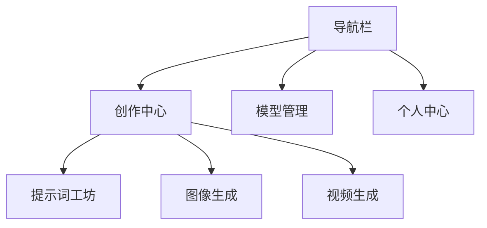

# 前端界面设计方案

## 🎨 界面架构


## 🖼️ 核心页面设计

### 1. 创作中心
```mermaid
graph LR
    A[提示词输入区] --> B[参数面板]
    B --> C[实时预览]
    C --> D[生成控制]
    D --> E[历史记录]
    
    功能模块:
    - 多模态输入支持文本/图片
    - 参数预设模板
    - 实时生成进度展示
    - 版本对比功能
```

### 2. 模型管理
```mermaid
graph TB
    A[模型列表] --> B[云端模型]
    A --> C[本地模型]
    B --> D[加载/卸载]
    C --> E[文件上传]
    D --> F[资源监控]
    
    功能要点:
    - 模型兼容性检测
    - 显存占用可视化
    - 推理速度测试
```

## 🛠️ 技术实现
| 模块         | 技术方案               | 版本   |
|--------------|-----------------------|-------|
| 框架         | React 18 + TypeScript | 18.2  |
| 状态管理     | Redux Toolkit         | 2.2.1 |
| UI组件库     | Ant Design Pro        | 6.0   |
| 可视化       | ECharts               | 5.4.3 |
| 路由         | React Router          | 6.23  |
```

2. **更新项目主文档**：
```

# 前端架构设计

## 技术选型
```javascript
// frontend/app.js 核心交互逻辑
$(document).ready(function() {
    // 初始化工具提示
    $('[data-bs-toggle="tooltip"]').tooltip()
    
    // 生成按钮点击事件
    $('#generate-btn').click(async () => {
        const params = {
            prompt: $('#prompt-input').val(),
            width: $('#width-select').val()
        }
        
        try {
            const res = await fetch('/api/generate', {
                method: 'POST',
                headers: {'Content-Type': 'application/json'},
                body: JSON.stringify(params)
            })
            updateResult(await res.json())
        } catch (err) {
            showError(err.message)
        }
    })
})
```

## 组件结构
```html
<!-- frontend/index.html 核心结构 -->
<div class="container">
  <div class="param-group">
    <label data-bs-toggle="tooltip" title="建议使用英文描述">
      提示词 <input id="prompt-input" type="text">
    </label>
  </div>
  
  <div class="preview-area">
    
  </div>
  
  <button id="generate-btn" class="btn btn-primary">
    <i class="bi bi-magic"></i> 立即生成
  </button>
</div>
```