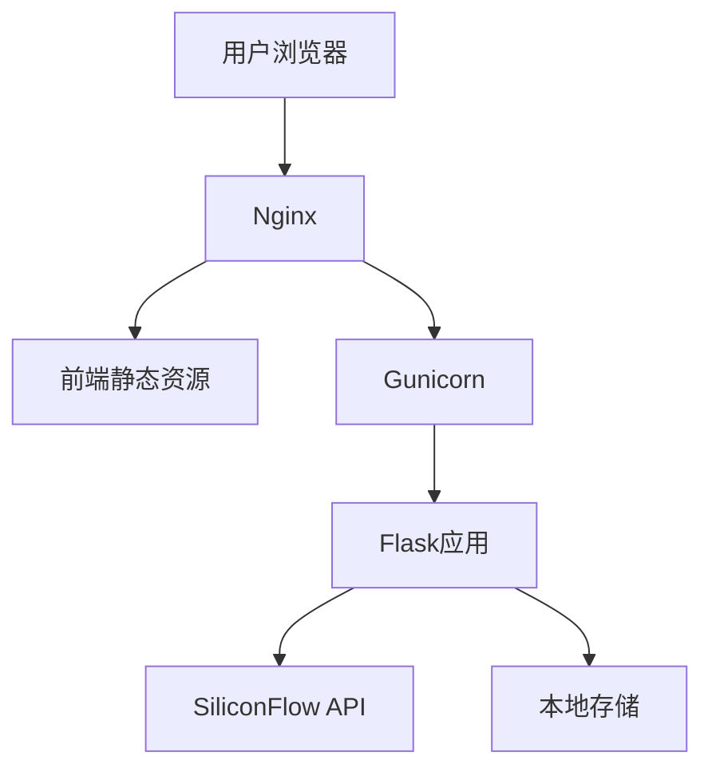
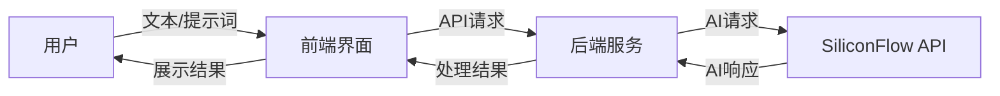

# AI应用需求规格说明书

## 1. 引言

### 1.1 项目背景
当前AI技术快速发展，各种基于大语言模型和生成式AI的应用需求增长迅速。本项目旨在构建一个基于Docker的AI Web应用，提供文本对话和图像生成功能，并为后续多模态扩展奠定基础。

### 1.2 项目目标
- 构建一个稳定可靠的AI应用平台，初期支持文本交互和图像生成
- 利用Docker实现开发与生产环境一致性，提高开发和部署效率
- 采用模块化设计，为后续功能扩展预留接口和扩展点
- 完善的文档和工程规范，确保团队协作效率

### 1.3 用户群体
- AI应用开发者和研究人员
- 企业用户（需要AI辅助工具）
- 对AI生成内容感兴趣的普通用户

## 2. 功能需求

### 2.1 核心功能
#### 2.1.1 AI文本对话（优先级：高）
- **功能描述**：支持与AI模型进行自然语言交互
- **关键特性**：
  - 支持多轮对话，保持上下文连贯性
  - 对话历史记录保存与查看
  - 基于SiliconFlow API的对话能力
- **技术实现**：
  - 后端与AI接口集成
  - 会话状态管理

#### 2.1.2 图像生成（优先级：高）
- **功能描述**：通过文本描述生成相应的图像
- **关键特性**：
  - 支持提示词（Prompt）输入和调整
  - 支持图像尺寸和生成参数配置
  - 图像结果保存与共享
- **技术实现**：
  - 集成SiliconFlow FLUX模型API
  - 参数验证和错误处理

### 2.2 辅助功能
#### 2.2.1 用户系统（优先级：中）
- 基本的用户注册/登录功能
- API密钥管理
- 用户偏好设置

#### 2.2.2 历史记录管理（优先级：中）
- 对话历史和生成图像的存储
- 历史记录浏览和搜索
- 收藏和标记功能

### 2.3 后续扩展功能（优先级：低）
- 多AI模型支持，允许用户切换不同的模型
- 音频处理：语音识别和语音合成
- 视频生成功能
- 多模态融合能力

## 3. 非功能需求

### 3.1 性能要求
- API响应时间：平均<1秒（不包括AI模型处理时间）
- 并发用户支持：初期支持50个同时在线用户
- 图像生成预计耗时：告知用户预期等待时间

### 3.2 安全要求
- 用户认证和授权
- API密钥安全存储
- 敏感数据加密
- 防止常见Web攻击（XSS、CSRF等）

### 3.3 可用性要求
- 系统可用性目标：99%
- 支持主流浏览器（Chrome、Firefox、Safari、Edge最新版）
- 响应式设计，支持桌面和移动设备访问

### 3.4 可维护性要求
- 完善的日志系统
- Docker容器化部署，便于维护和扩展
- 模块化代码架构
- 全面的文档支持

## 4. 技术架构

### 4.1 技术栈选择
| 组件 | 技术方案 | 说明 |
|------|---------|------|
| 前端 | HTML/JavaScript/CSS + Bootstrap | 轻量级UI，简单易维护 |
| 后端 | Python Flask | 灵活的REST API框架 |
| 容器化 | Docker + Docker Compose | 环境一致性保障 |
| AI接口 | SiliconFlow API | 提供AI模型能力 |
| 部署 | Nginx + Gunicorn | 生产环境Web服务 |

### 4.2 系统架构图

### 4.3 数据流图

## 5. 项目规划与里程碑

### 5.1 开发阶段
1. **阶段一：基础架构**（2周）
   - 环境搭建与Docker配置
   - 前后端基础框架开发
   - API接口设计

2. **阶段二：核心功能**（3周）
   - AI文本对话功能实现
   - 图像生成功能实现
   - 前端UI设计与实现

3. **阶段三：功能完善**（2周）
   - 用户系统集成
   - 历史记录功能
   - 错误处理和异常情况

4. **阶段四：测试与部署**（1周）
   - 功能测试与bug修复
   - 性能优化
   - 生产环境部署

### 5.2 验收标准
- 用户能够成功进行AI文本对话
- 用户能够通过提示词生成图像
- 系统能够稳定运行，无严重bug
- Docker环境能够顺利部署
- 文档完善，符合项目规范

## 6. 附录

### 6.1 术语表
| 术语 | 定义 |
|------|------|
| SiliconFlow | 提供AI模型API服务的厂商 |
| Prompt | 用于生成图像的文本描述或提示词 |
| Flask | Python的轻量级Web应用框架 |
| Docker | 应用容器化平台 |
| Gunicorn | Python WSGI HTTP服务器 |

### 6.2 参考资料
- SiliconFlow API文档
- Flask官方文档: https://flask.palletsprojects.com/
- Docker文档: https://docs.docker.com/